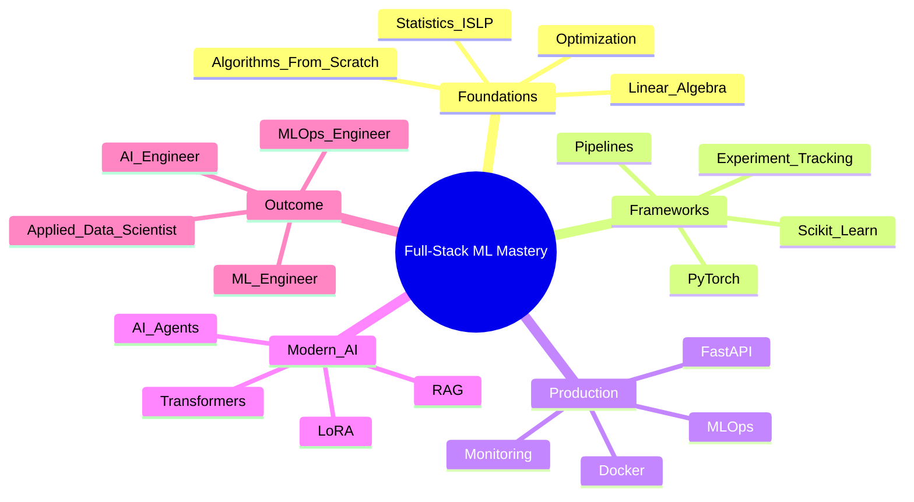

# ML Full-Stack Mastery

**End-to-end machine learning roadmap covering white-box foundations, production ML pipelines, MLOps, and modern GenAI systems.**

This repository is a **single, cohesive learning and portfolio project** designed to demonstrate the complete lifecycle of machine learning systems — from mathematical foundations to deployed, production-grade AI applications.

It intentionally avoids two common pitfalls:

* *Theory-only ML* (strong math, no shipping skills)
* *Tool-only ML* (APIs without understanding)

Instead, it follows a **white-box → framework → production** progression.

---

## Project Philosophy — The “Sandwich” Approach

This project is structured using a **three-layer learning model**:

1. **White-Box Foundations (Bottom Layer)**
   Understand *how* algorithms work by implementing them from scratch.

2. **Framework & Pipeline Mastery (Middle Layer)**
   Use industry-standard tools to build scalable, reusable ML pipelines.

3. **Production & Systems Engineering (Top Layer)**
   Deploy, monitor, and maintain ML systems in real-world settings.

The goal is not just to train models, but to **own the entire ML system**.

---

## Visual Roadmap (Mind Map)



---

## Repository Structure

```
ml-fullstack-mastery/
│
├── theory-foundations/        # White-box ML & math from scratch
├── framework-projects/        # End-to-end ML pipelines
├── advanced-projects/         # RAG, agents, and MLOps systems
├── notebooks/                 # Exploratory work (refactored later)
├── docs/                      # Weekly logs, model cards, resources
├── tests/                     # Unit and integration tests
│
├── environment.yml            # Canonical conda environment
├── requirements.txt           # pip-compatible dependency lock
├── Dockerfile                 # Production container template
├── Makefile                   # Standardized commands
└── README.md
```

---

## Sources Used — What, Where, and Why

This project deliberately combines **books, courses, and engineering practices**, each chosen for a specific role.

### 1. White-Box Foundations (Used in `theory-foundations/`)

| Source                                          | Where Used                              | Why                                            |
| ----------------------------------------------- | --------------------------------------- | ---------------------------------------------- |
| **Joel Grus – Data Science from Scratch**       | Linear algebra, regression, Naive Bayes | Builds algorithmic intuition using pure Python |
| **Danny Friedman – ML from Scratch**            | Optimization, gradient descent          | Clear mathematical derivations                 |
| **ISLP (Introduction to Statistical Learning)** | Evaluation, inference, resampling       | Statistical rigor and model interpretation     |

**Why these first:**
Frameworks hide too much. These sources ensure every model used later is **understood, not memorized**.

---

### 2. Framework & Pipeline Mastery (Used in `framework-projects/`)

| Source                                  | Where Used                                | Why                                        |
| --------------------------------------- | ----------------------------------------- | ------------------------------------------ |
| **Aurélien Géron – Hands-On ML**        | End-to-end pipelines, feature engineering | Industry-realistic ML workflows            |
| **Sebastian Raschka – ML with PyTorch** | PyTorch fundamentals, deep learning       | Clean mental model of tensors and autograd |
| **scikit-learn**                        | Classical ML pipelines                    | Still the standard for tabular ML          |

**Key focus here:**
Reproducibility, clean APIs, testing, and model evaluation — not just accuracy.

---

### 3. Production & MLOps (Used across `framework-projects/` and `advanced-projects/`)

| Source                            | Where Used                      | Why                              |
| --------------------------------- | ------------------------------- | -------------------------------- |
| **Alexey Grigorev – ML Bookcamp** | Deployment, FastAPI services    | Practical ML engineering         |
| **MLOps Zoomcamp**                | Experiment tracking, monitoring | Production lifecycle management  |
| **MLflow**                        | Experiment tracking             | Reproducibility and traceability |
| **Docker**                        | Deployment                      | Environment consistency          |

This is where models become **products**.

---

### 4. Modern GenAI Systems (Used in `advanced-projects/`)

| Source                      | Where Used                            | Why                            |
| --------------------------- | ------------------------------------- | ------------------------------ |
| **Hugging Face LLM Course** | Transformers, fine-tuning, embeddings | Industry standard for NLP/LLMs |
| **PEFT / LoRA**             | Efficient fine-tuning                 | Practical GenAI adaptation     |
| **FAISS**                   | Vector search                         | Scalable retrieval             |
| **Agent frameworks**        | Tool-using AI systems                 | System-level reasoning         |

Focus here is **system design**, not just calling an LLM API.

---

## Engineering Standards Followed

* **Notebooks are exploratory only**
  Final logic lives in `.py` modules.
* **Every non-trivial function is testable**
* **Dependencies are locked**
* **Code is refactored from learning → production**
* **Each project includes a business-focused README**

---

## What This Repository Demonstrates

By the end of this roadmap, this repository shows the ability to:

* Implement ML algorithms from first principles
* Build robust ML pipelines
* Evaluate models statistically (not just accuracy)
* Deploy containerized ML services
* Build and reason about GenAI systems (RAG, agents)
* Apply MLOps practices for long-term reliability

---

## Target Roles

* Machine Learning Engineer
* Applied Data Scientist
* AI / GenAI Engineer
* MLOps Engineer

---

## Differentiation Statement

> **This is not a collection of notebooks.**
> It is a full-stack machine learning system portfolio demonstrating understanding, implementation, deployment, and maintenance of real-world ML systems.

---

## Environment Setup (Local)

```bash
conda env create -f environment.yml
conda activate ml-fullstack
```

---

