# 🚀 ML Full-Stack Mastery

**An integrated learning journey from mathematical foundations to production AI systems — through code, not just theory.**

[](https://www.python.org/downloads/)
[](https://opensource.org/licenses/MIT)
[](https://ml-ops.org/)
[](README.md)

A **cohesive, production-focused curriculum** that bridges the gap between theoretical machine learning and real-world engineering. This repository documents the complete 12-week journey of building, deploying, and maintaining machine learning systems — with every project production-ready and portfolio-grade.

## 🎯 What Problem Does This Solve?

The machine learning landscape suffers from a **bimodal distribution of expertise**:

| **Theory-Only Practitioners** | **Tool-Only Practitioners** |
|------------------------------|-----------------------------|
| • Understand math proofs     | • Can deploy pre-trained models |
| • Can't scale systems        | • Can't diagnose failures |
| • Struggle with deployment   | • Lack algorithmic intuition |
| • **"Paper Tigers"** | **"API Consumers"** |

This repository demonstrates **the middle path**: deep understanding *combined with* production engineering skills.

## 📊 Complete Curriculum Visualization

```mermaid
flowchart TD
    A[🎯 Full-Stack ML Mastery] --> B[Phase 1: Foundations]
    A --> C[Phase 2: Production]
    A --> D[Phase 3: Advanced]
    A --> E[🎓 Career Outcomes]
    
    B --> B1[📘 Mathematical Intuition]
    B --> B2[📈 Statistical Rigor]
    B --> B3[⚙️ Algorithm Implementation]
    
    C --> C1[🏗️ Pipeline Architecture]
    C --> C2[📦 Containerization]
    C --> C3[🔍 Experiment Tracking]
    C --> C4[📊 Monitoring]
    
    D --> D1[🤖 Transformer Systems]
    D --> D2[🔗 RAG Architecture]
    D --> D3[🤝 AI Agents]
    D --> D4[⚡ PEFT/LoRA]
    
    E --> E1[ML Engineer]
    E --> E2[AI Engineer]
    E --> E3[MLOps Engineer]
    E --> E4[Research Engineer]
    
    style A fill:#2e86ab,color:#fff
    style B fill:#a23b72,color:#fff
    style C fill:#f18f01,color:#000
    style D fill:#73ab84,color:#fff
    style E fill:#c73e1d,color:#fff

```



## 🏗️ Repository Architecture: Two-Portfolio Strategy

This repository implements a **dual-portfolio approach** — one for academic depth, one for engineering excellence.

```text
ml-fullstack-mastery/
│
├── 📚 THEORY PORTFOLIO (Academic Depth)
│   ├── 01-linear-algebra/
│   │   ├── vector_class.py      # Pure Python vector operations (Grus-style)
│   │   ├── matrix_operations.py # Manual matrix multiplication
│   │   └── benchmarks.ipynb     # Python lists vs NumPy performance
│   │
│   ├── 02-optimization/
│   │   ├── gradient_descent.py  # From scratch implementation
│   │   ├── normal_equation.py   # Linear algebra solution
│   │   └── convergence_plots.ipynb
│   │
│   ├── 03-algorithms-from-scratch/
│   │   ├── linear_regression.py # Manual gradient derivation
│   │   ├── logistic_regression.py
│   │   ├── decision_tree.py
│   │   └── mlp_scratch.py       # Neural network with manual backprop
│   │
│   └── 04-statistical-rigor/
│       ├── bias_variance.py     # ISLP concepts implemented
│       ├── cross_validation.py
│       └── residual_analysis.py
│
├── ⚙️ PRODUCTION PORTFOLIO (Engineering Excellence)
│   ├── 01-housing-pipeline/
│   │   ├── src/
│   │   │   ├── data_fetcher.py
│   │   │   ├── custom_transformers.py  # Scikit-learn compatible
│   │   │   ├── pipeline_builder.py
│   │   │   └── train.py
│   │   ├── tests/
│   │   │   └── test_transformers.py
│   │   ├── config/
│   │   │   └── params.yaml
│   │   ├── Dockerfile
│   │   └── README.md             # Business impact documentation
│   │
│   ├── 02-churn-prediction-service/
│   │   ├── app/
│   │   │   ├── api.py            # FastAPI endpoints
│   │   │   ├── schemas.py        # Pydantic models
│   │   │   └── middleware.py
│   │   ├── ml/
│   │   │   ├── train.py          # MLflow integrated
│   │   │   ├── predict.py
│   │   │   └── model_card.md     # Ethical AI documentation
│   │   ├── docker-compose.yml
│   │   ├── Makefile
│   │   └── monitoring/
│   │       └── evidently_dashboard.py
│   │
│   ├── 03-llm-rag-system/
│   │   ├── retrieval/
│   │   │   ├── chunking_strategies.py
│   │   │   └── vector_store.py  # FAISS/ChromaDB integration
│   │   ├── generation/
│   │   │   ├── prompt_templates.py
│   │   │   └── llm_orchestrator.py
│   │   └── evaluation/
│   │       └── ragas_metrics.py
│   │
│   └── 04-mlops-orchestration/
│       ├── workflows/
│       │   └── training_pipeline.py  # Prefect/Mage
│       ├── registry/
│       │   └── model_versioning.py
│       └── monitoring/
│           └── drift_detection.py
│
├── 📓 NOTEBOOKS/                  # Exploratory work (temporary)
│   ├── 01-eda-housing.ipynb
│   ├── 02-model-prototyping.ipynb
│   └── 03-llm-experiments.ipynb
│
├── 📁 docs/
│   ├── weekly-progress/
│   ├── model-cards/
│   ├── architecture-decisions/
│   └── resources/
│
├── 🧪 tests/
│   ├── unit/
│   ├── integration/
│   └── e2e/
│
├── environment.yml                # Conda environment (reproducible)
├── requirements.txt               # pip dependencies
├── pyproject.toml                 # Modern Python packaging
├── Makefile                       # Standardized commands
├── Dockerfile                     # Production container
└── README.md

```

## 📚 Curated Resource Integration Matrix

### 🔬 Layer 1: Foundational Understanding

| Resource | Purpose | Implementation Location | Key Deliverable |
| --- | --- | --- | --- |
| **Grus: Data Science from Scratch** | Algorithmic intuition through pure Python | `theory-foundations/01-linear-algebra/` | Custom Vector/Matrix classes |
| **Friedman: ML from Scratch** | Mathematical derivation & optimization | `theory-foundations/02-optimization/` | Gradient descent with convergence proofs |
| **ISLP** | Statistical rigor & model evaluation | `theory-foundations/04-statistical-rigor/` | Bias-variance analysis, confidence intervals |

### ⚙️ Layer 2: Industrial Tooling

| Resource | Purpose | Implementation Location | Key Deliverable |
| --- | --- | --- | --- |
| **Géron: Hands-On ML** | Production pipelines & Scikit-Learn mastery | `production-portfolio/01-housing-pipeline/` | Custom transformers, ColumnTransformer |
| **Raschka: ML with PyTorch** | Deep learning foundations | Throughout Phase 2 projects | Tensor operations, autograd understanding |
| **Scikit-Learn Documentation** | API design patterns | All framework projects | Consistent fit/predict/transform patterns |

### 🚀 Layer 3: Production Systems

| Resource | Purpose | Implementation Location | Key Deliverable |
| --- | --- | --- | --- |
| **Grigorev: ML Bookcamp** | Deployment & API design | `production-portfolio/02-churn-service/` | FastAPI service, Docker container |
| **MLOps Zoomcamp** | Lifecycle management | `production-portfolio/04-mlops-orchestration/` | MLflow tracking, Prefect workflows |
| **Docker/Kubernetes Docs** | Container orchestration | `infrastructure/` | Production-grade deployment |

### 🤖 Layer 4: Modern AI Systems

| Resource | Purpose | Implementation Location | Key Deliverable |
| --- | --- | --- | --- |
| **Hugging Face Courses** | LLM fine-tuning & embeddings | `production-portfolio/03-llm-rag-system/` | LoRA fine-tuning, embedding pipelines |
| **FAISS & Vector DBs** | Scalable similarity search | `retrieval/vector_store.py` | Milvus/ChromaDB integration |
| **LangChain/LlamaIndex** | Agent & RAG systems | `generation/llm_orchestrator.py` | Tool-using agents, document QA |

## 🗓️ 12-Week Learning Progression

### Phase 1: Foundations (Weeks 1-4) — "Understand the Engine"

```python
# Example: Week 2 - Linear Regression from multiple perspectives
from theory_foundations.optimization import GradientDescent  # Friedman's derivation
from theory_foundations.statistics import ConfidenceInterval # ISLP's inference
from production_portfolio.pipelines import LinearRegressionPipeline # Géron's approach

# One concept, three perspectives:
# 1. Mathematical optimization
# 2. Statistical inference  
# 3. Production implementation

```

### Phase 2: Production Engineering (Weeks 5-8) — "Build the Car"

* **Week 5-6**: Scikit-Learn pipelines with custom transformers
* **Week 7**: Experiment tracking with MLflow
* **Week 8**: Containerization & API deployment

### Phase 3: Advanced Systems (Weeks 9-12) — "Drive in Traffic"

* **Week 9-10**: LLM fine-tuning & RAG systems
* **Week 11**: AI agents with tool usage
* **Week 12**: Portfolio polish & system design

## 🧪 Engineering Standards & Quality Gates

### Code Quality Evolution

```python
# PHASE 1: Learning Code (Weeks 1-4)
# notebooks/01-linear-regression.ipynb
# - Exploratory
# - Visual
# - Story-driven

# PHASE 2: Transition (Weeks 5-8)  
# theory_foundations/linear_regression.py
# - Modular functions
# - Docstrings
# - Basic tests

# PHASE 3: Production Code (Weeks 9-12)
# production_portfolio/regression_service/
# - Classes with single responsibility
# - Type hints
# - Unit + integration tests
# - Error handling
# - Logging
# - Configuration management

```

### Testing Strategy

| Test Type | Coverage Goal | Tools Used | When Implemented |
| --- | --- | --- | --- |
| **Unit Tests** | 80%+ core logic | pytest | Weeks 3-4 |
| **Integration Tests** | Critical paths | pytest, Docker | Weeks 7-8 |
| **ML Model Tests** | Prediction consistency | deepchecks, sklearn | Weeks 5-6 |
| **API Tests** | All endpoints | fastapi-testclient | Weeks 8-9 |

## 🚀 Quick Start

### 1. Clone & Setup

```bash
git clone [https://github.com/yourusername/ml-fullstack-mastery.git](https://github.com/yourusername/ml-fullstack-mastery.git)
cd ml-fullstack-mastery

# Option A: Conda (recommended)
conda env create -f environment.yml
conda activate ml-fullstack

# Option B: pip
pip install -r requirements.txt

```

### 2. Verify Installation

```bash
# Verify Python environment
python -c "import numpy; import torch; print('Environment Ready ✅')"

```

### 3. Start Learning Journey

```bash
# Begin with foundational linear algebra
cd theory-foundations/linear-algebra
python vector_operations.py  # Should pass checks
jupyter lab  # To view benchmarks

```

## 📈 Success Metrics & Portfolio Requirements

### Mandatory Portfolio Pieces

* [ ] **1+ Deployed ML Service** (Docker + REST API + monitoring)
* [ ] **1+ RAG System** (Vector DB + LLM + evaluation metrics)
* [ ] **1+ From-Scratch Algorithm Library** (Linear models → neural nets)
* [ ] **1+ MLOps Pipeline** (Experiment tracking → deployment automation)
* [ ] **Comprehensive Test Suite** (Unit + integration + model tests)

### Knowledge Validation

```python
def validate_understanding():
    """Can you explain AND implement these concepts?"""
    concepts = {
        "gradient_descent": "Derive update rule from calculus",
        "bias_variance": "Implement tradeoff visualization", 
        "attention_mechanism": "Code scaled dot-product attention",
        "model_deployment": "Containerize and serve with FastAPI",
        "rag_evaluation": "Calculate retrieval precision + answer relevance"
    }
    return all(concepts.values())  # True when all are mastered

```

## 🎯 Target Career Outcomes

| Role | Skills Demonstrated | Portfolio Evidence |
| --- | --- | --- |
| **ML Engineer** | Pipeline architecture, deployment, monitoring | Churn prediction service + MLOps pipeline |
| **AI Engineer** | LLM fine-tuning, RAG systems, embeddings | Document QA system + LoRA fine-tuning |
| **MLOps Engineer** | CI/CD, experiment tracking, drift detection | Full ML lifecycle automation |
| **Research Engineer** | Algorithm implementation, benchmarking | From-scratch library + ablation studies |

## 🔍 Project Philosophy in Practice

### The "White Box First" Principle

Every algorithm is implemented **three times**:

1. **From scratch** (pure Python/math)
2. **With frameworks** (Scikit-Learn/PyTorch)
3. **In production** (containerized, monitored)

### Anti-Patterns Avoided

```python
# ❌ DON'T: Black box usage only
model = SomeLibraryClassifier().fit(X, y)

# ✅ DO: Understand then implement
# 1. First principles
gradient = compute_gradient_manually(X, y, theta)
# 2. Framework usage  
model = SGDClassifier().fit(X, y)
# 3. Production deployment
service = ModelService(model).deploy()

```

## 🤝 Contributing & Community

This is a **living curriculum**. Contributions are welcome in:

1. **New project ideas** with real-world datasets
2. **Updated implementations** for newer library versions
3. **Additional tests** and quality checks
4. **Documentation improvements** and learning tips

### Contribution Workflow

```bash
# 1. Fork the repository
# 2. Create a feature branch
git checkout -b feature/new-algorithm-implementation

# 3. Add tests for your changes
# 4. Ensure all tests pass
pytest

# 5. Submit a pull request with:
# - Clear description of changes
# - Links to relevant resources
# - Demonstration of understanding

```

## 📄 License & Attribution

This repository is **MIT Licensed**. The learning materials and curriculum structure are free to use, modify, and distribute.

### Key Source Attribution

* Book concepts: Grus, Friedman, ISLP, Géron, Raschka, Grigorev
* Course materials: Fast.ai, Hugging Face, MLOps Zoomcamp
* Engineering practices: Inspired by Google, Meta, and OpenAI production ML

### Academic Integrity

This project demonstrates **understanding through implementation**, not direct copying. All code is either:

* Original implementation of published algorithms
* Integration of open-source libraries with proper attribution
* Novel combinations of established patterns

---

## 🚀 Ready to Begin?

Start your journey in `theory-foundations/linear-algebra/` and follow the 12-week progression.

> *"The master has failed more times than the beginner has even tried."* > — Start failing productively today.

---
